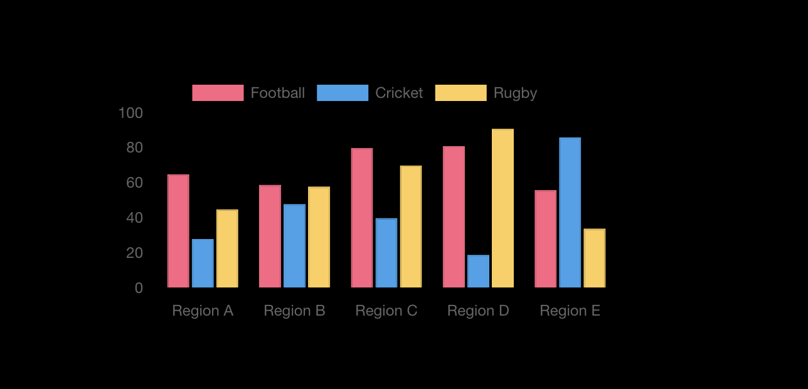

# Vue Chart App

This is a simple Vue.js application that displays an interactive chart using Chart.js library.


## Installation

1. Clone the repository:
2. Navigate to the project directory:
3. Install dependencies:
```bash
npm install
```
```bash
yarn install
```
4. Run the development server:

```bash
npm run serve
```
```bash
yarn serve
```

5. Open your browser and visit `http://localhost:8080` to see the application running.

## Usage

The application displays a bar chart with random data for three different sports: Football, Cricket, and Rugby. Each bar represents a Region (A, B, C, D, E) and the height of the bar represents the value for that category.

## Updating Data

To update the data in the chart:

1. Modify the data in the `data.json` file located in the root directory. The file contains labels and datasets for the chart.

2. Save the changes.

3. Refresh the browser to see the updated chart with the new data.

## Technologies Used

- Vue.js
- Chart.js
- JavaScript
- HTML/CSS

## Folder Structure

```
vue-chart-app/
│
├── public/
│   ├── index.html
│   └── ...
│
├── src/
│   ├── App.vue
│   ├── main.js
│   └── ...
│
├── data.json
├── package.json
└── ...
```

## Credits

- [Vue.js](https://vuejs.org/)
- [Chart.js](https://www.chartjs.org/)
- [Vue Chart.js Wrapper](https://vue-chartjs.org/)

## License

This project is licensed under the [MIT License](LICENSE).
